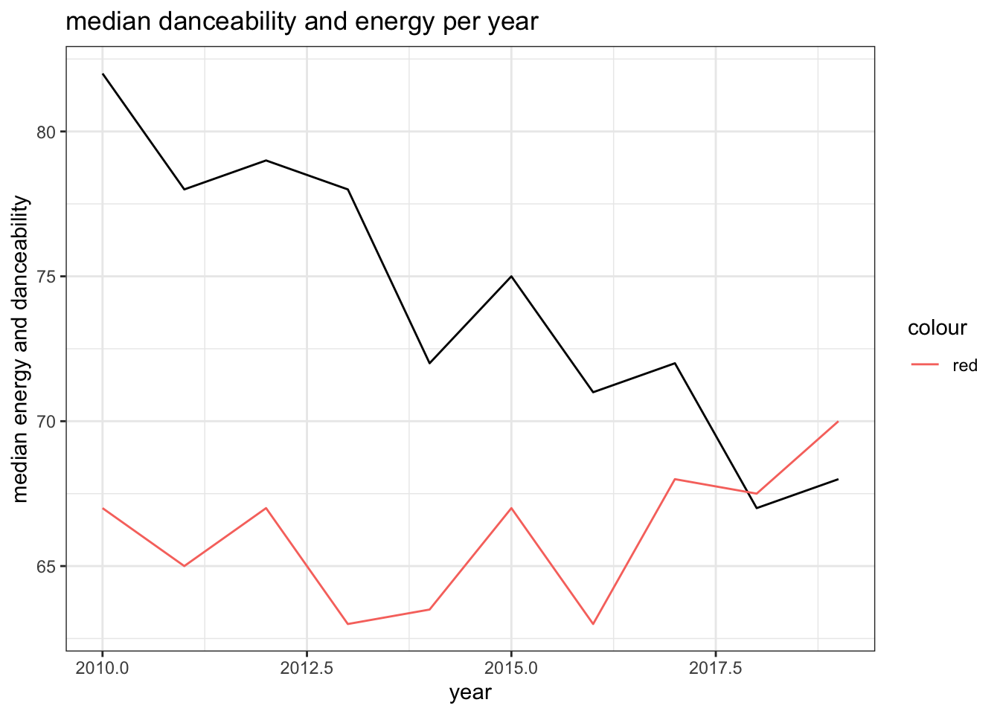

# Exercise 1

::: {.cell}

:::


## Question 1


::: {.cell}

:::


The dataset contains 184 artists , 584 songs and 50 genres

## Question 2


::: {.cell}
::: {.cell-output-display}
| year| number of songs|
|----:|---------------:|
| 2010|              51|
| 2011|              53|
| 2012|              35|
| 2013|              71|
| 2014|              58|
| 2015|              95|
| 2016|              80|
| 2017|              65|
| 2018|              64|
| 2019|              31|
:::
:::


## Question 3 


::: {.cell}

:::


The most popular artist is Katy Perry with 17 songs

## Question 4


::: {.cell}
::: {.cell-output-display}
|top genre                 | minimum| maximum|     mean| nb_songs|
|:-------------------------|-------:|-------:|--------:|--------:|
|acoustic pop              |     125|     185| 155.0000|        2|
|alaska indie              |     132|     132| 132.0000|        1|
|alternative r&b           |     136|     136| 136.0000|        1|
|art pop                   |      94|     150| 115.1250|        8|
|atl hip hop               |      80|     130| 108.5000|        4|
|australian dance          |      87|     192| 128.8333|        6|
|australian hip hop        |      95|      95|  95.0000|        1|
|australian pop            |     127|     186| 153.8000|        5|
|barbadian pop             |      78|     206| 125.3333|       15|
|baroque pop               |     108|     184| 146.0000|        2|
|belgian edm               |     122|     122| 122.0000|        2|
|big room                  |     106|     134| 122.3000|       10|
|boy band                  |      77|     160| 116.1333|       15|
|british soul              |       0|     164| 109.3333|        9|
|brostep                   |     100|     142| 121.0000|        2|
|canadian contemporary r&b |      93|     186| 130.0000|        7|
|canadian hip hop          |     100|     118| 109.0000|        2|
|canadian latin            |      98|      98|  98.0000|        1|
|canadian pop              |      65|     192| 122.1290|       31|
|candy pop                 |      92|     126| 109.0000|        2|
|celtic rock               |      85|      85|  85.0000|        1|
|chicago rap               |     125|     125| 125.0000|        1|
|colombian pop             |     112|     138| 126.0000|        3|
|complextro                |     102|     130| 120.3333|        6|
|contemporary country      |      86|      86|  86.0000|        1|
|dance pop                 |      43|     202| 118.5975|      323|
|danish pop                |     120|     120| 120.0000|        1|
|detroit hip hop           |      82|      87|  84.5000|        2|
|downtempo                 |     100|     167| 133.5000|        2|
|edm                       |      90|     118| 103.0000|        4|
|electro                   |     100|     116| 108.0000|        2|
|electro house             |     124|     124| 124.0000|        1|
|electronic trap           |      96|     100|  98.0000|        2|
|electropop                |      90|     160| 112.8462|       13|
|escape room               |      96|     158| 127.0000|        2|
|folk-pop                  |      75|      86|  80.5000|        2|
|french indie pop          |     123|     123| 123.0000|        1|
|hip hop                   |      80|     112|  93.7500|        4|
|hip pop                   |      93|     111| 100.6667|        6|
|hollywood                 |      92|      92|  92.0000|        1|
|house                     |     122|     122| 122.0000|        1|
|indie pop                 |     148|     155| 151.5000|        2|
|irish singer-songwriter   |     129|     129| 129.0000|        1|
|latin                     |      94|     186| 140.7500|        4|
|metropopolis              |     127|     127| 127.0000|        1|
|moroccan pop              |     110|     110| 110.0000|        1|
|neo mellow                |      76|     138| 109.1111|        9|
|permanent wave            |     125|     148| 137.2500|        4|
|pop                       |      77|     190| 116.8727|       55|
|tropical house            |     120|     139| 129.5000|        2|
:::
:::


## Question 5 


::: {.cell}
::: {.cell-output .cell-output-stdout}
```
# A tibble: 10 × 3
    year `median energy` `median danceability`
   <int>           <dbl>                 <dbl>
 1  2010              82                  67  
 2  2011              78                  65  
 3  2012              79                  67  
 4  2013              78                  63  
 5  2014              72                  63.5
 6  2015              75                  67  
 7  2016              71                  63  
 8  2017              72                  68  
 9  2018              67                  67.5
10  2019              68                  70  
```
:::
:::


## Question 6 

::: {.cell}
::: {.cell-output-display}
{width=672}
:::
:::


# Exercise 2
## Question 1

::: {.cell}

:::

::: {.cell}
::: {.cell-output .cell-output-stdout}
```
# A tibble: 12 × 3
   Gender `Marital status`  `median age at enrollment`
   <fct>  <fct>                                  <dbl>
 1 Male   single                                  20  
 2 Male   married                                 37  
 3 Male   divorced                                40.5
 4 Male   widower                                 43  
 5 Male   facto union                             34  
 6 Male   legally separated                       55  
 7 Female single                                  19  
 8 Female married                                 34  
 9 Female divorced                                38  
10 Female widower                                 21  
11 Female facto union                             27  
12 Female legally separated                       41  
```
:::
:::

## Question 2

::: {.cell}
::: {.cell-output-display}
|Marital status    | Male| Female|
|:-----------------|----:|------:|
|single            | 20.0|     19|
|married           | 37.0|     34|
|divorced          | 40.5|     38|
|widower           | 43.0|     21|
|facto union       | 34.0|     27|
|legally separated | 55.0|     41|
:::
:::

## Question 3

::: {.cell}
::: {.cell-output .cell-output-stdout}
```
# A tibble: 3 × 13
  Target   Curricular units 1st …¹ Curricular units 1st…² Curricular units 1st…³
  <fct>                      <dbl>                  <dbl>                  <dbl>
1 Dropout                    0.609                   5.82                   7.75
2 Graduate                   0.847                   6.67                   8.28
3 Enrolled                   0.508                   5.96                   9.34
# ℹ abbreviated names: ¹​`Curricular units 1st sem (credited)`,
#   ²​`Curricular units 1st sem (enrolled)`,
#   ³​`Curricular units 1st sem (evaluations)`
# ℹ 9 more variables: `Curricular units 1st sem (approved)` <dbl>,
#   `Curricular units 1st sem (grade)` <dbl>,
#   `Curricular units 1st sem (without evaluations)` <dbl>,
#   `Curricular units 2nd sem (credited)` <dbl>, …
```
:::
:::

## Question 4

::: {.cell}
::: {.cell-output-display}
|Units                                          |   Dropout|   Graduate|   Enrolled|
|:----------------------------------------------|---------:|----------:|----------:|
|Curricular units 1st sem (credited)            | 0.6094300|  0.8474423|  0.5075567|
|Curricular units 1st sem (enrolled)            | 5.8212526|  6.6695337|  5.9647355|
|Curricular units 1st sem (evaluations)         | 7.7515834|  8.2765957|  9.3413098|
|Curricular units 1st sem (approved)            | 2.5517241|  6.2322318|  4.3186398|
|Curricular units 1st sem (grade)               | 7.2566555| 12.6436545| 11.1252573|
|Curricular units 1st sem (without evaluations) | 0.1921182|  0.0882752|  0.1775819|
|Curricular units 2nd sem (credited)            | 0.4496833|  0.6668176|  0.3589421|
|Curricular units 2nd sem (enrolled)            | 5.7804363|  6.6283386|  5.9382872|
|Curricular units 2nd sem (evaluations)         | 7.1738213|  8.1421458|  9.4357683|
|Curricular units 2nd sem (approved)            | 1.9401830|  6.1770032|  4.0579345|
|Curricular units 2nd sem (grade)               | 5.8993389| 12.6972758| 11.1173643|
|Curricular units 2nd sem (without evaluations) | 0.2378607|  0.0805794|  0.1876574|
:::
:::
